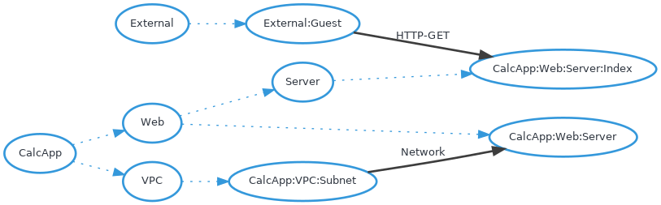

# Threatspec Project Threat Model

A threatspec project.


# Diagram



# Exposures


# Acceptances


# Transfers


# Mitigations


# Reviews


# Connections

## External:Guest To CalcApp:Web:Server:Index
HTTP-GET

```
# @connects #guest to #index with HTTP-GET
@flask_app.route('/')
def index_page():
    print(request.headers)
    isUserLoggedIn = False
    if 'token' in request.cookies:

```
/home/kali/cyber/projects/secure_rest_calculator/app/main.py:1

## CalcApp:VPC:Subnet To CalcApp:Web:Server
Network

```
# @connects #subnet to #web_server with Network
resource "aws_instance" "cyber94_calculator_oabu_server_public_tf" {
  ami = "ami-0943382e114f188e8"
  instance_type = "t2.micro"
  key_name = "cyber-oabu-key"
  associate_public_ip_address = true

```
/home/kali/cyber/projects/secure_rest_calculator/terraform-infra/main.tf:1


# Components

## External:Guest

## CalcApp:Web:Server:Index

## CalcApp:VPC:Subnet

## CalcApp:Web:Server


# Threats


# Controls
